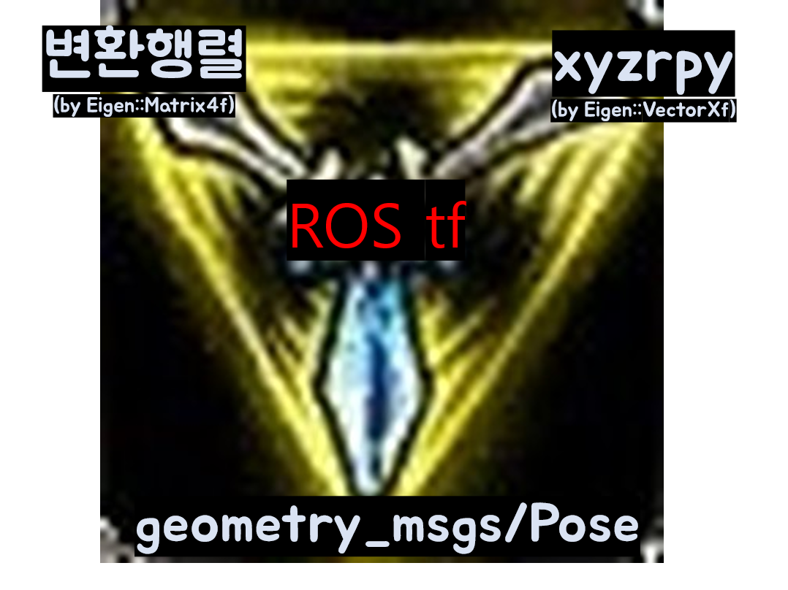
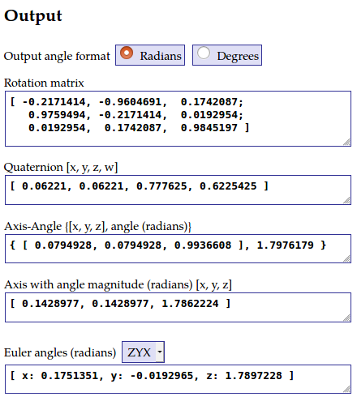
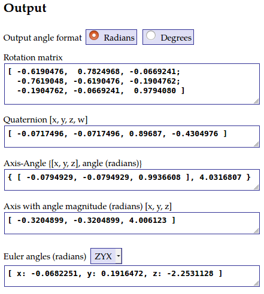
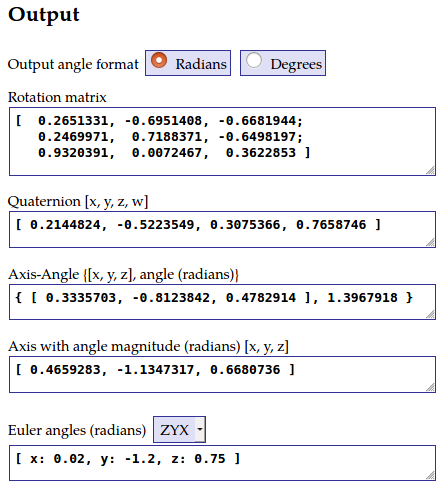
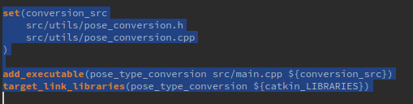

# Pose Conversion Package for ROS

### ROS로 개발할시 type 변환을 용이하게 해주는 라이브러리



Original Author: 임형태 (shapelim@kaist.ac.kr)

원래 [연구실](http://urobot.kaist.ac.kr/) 내에서 공유하는 URL Navigation Library(unavlib)의 일부를 

ROS tf 공부할 겸 다시 정리했습니다. :smirk:

Special thanks to 김형진(hjkim86@kaist.ac.kr) and 송승원(sswan55@kaist.ac.kr)

---

ver 1.0. geometry_msgs/Pose <-> Eigen::Matrix4f <-> xyzrpy(by Eigen::VectorXf) 변환

---

### Dependency libraries

* Eigen (default version of ROS)
* pcl (default version of ROS)
* tf (default version of ROS)
---

### 사용해야하는 이유

ROS 상에서 로봇의 pose들은 [nav_msgs/Odometry](http://docs.ros.org/melodic/api/nav_msgs/html/msg/Odometry.html)나 [geometry_msgs/PoseStamped](http://docs.ros.org/melodic/api/geometry_msgs/html/msg/PoseStamped.html)로 데이터를 제공하는데, 이 메세지를 C++ 상에서 활용하려면 Eigen의(python으로 치면 numpy 같은?) Matrix로 변환해서 사용하는 것이 편하다. 4x4 변환행렬(transformation matrix)로 pose를 포현하게 되면 상대적인 pose나 pose의 좌표계의 변환이 굉장히 용이해진다!

### 사용법 

1. Download this repository 
<pre><code>$ cd /home/$usr_name/catkin_ws/src</code></pre>
<pre><code>$ git clone https://github.com/LimHyungTae/pose_conversion.git</code></pre>

2. Build this ros code as follows.
<pre><code>$ cd /home/$usr_name/catkin_ws</code></pre>
<pre><code>$ catkin_make pose_conversion</code></pre>

Or if you use catkin-tools, then type below line on the command
<pre><code>$ catkin build pose_conversion</code></pre>

3. Rosrun example file
<pre><code>$ rosrun pose_conversion pose_type_conversion </code></pre>


Prerequisites
-----
## 테스트 및 검증

검증 내용은 src/main.cpp에 모두 포함되어 있다.

[Online 3D Rotation Converter](https://www.andre-gaschler.com/rotationconverter/)를 통해 여러 값들을 직접 대입하여 라이브러리를 통해 산출된 값이 맞는지 확인해보았다.

**NOTE 쿼터니언/변환행렬에서 rpy로 변환하는 과정에서 rpy의 값이 약 0.001~0.002정도 변하는 것을 확인해다.** 아마 float과 double의 형변환 과정에서 발생한 에러이거나, 혹은 수치해석적인 작은 에러로 보인다.

#### Test case 1. geometry_msgs/Pose -> 4x4 transformation matrix / xyzrpy
```cpp
geometry_msgs::Pose geoPoseInput; /
geoPoseInput.position.x = 7.9;
geoPoseInput.position.y = 6.5;
geoPoseInput.position.z = 4.4;

geoPoseInput.orientation.x = 0.062221;
geoPoseInput.orientation.y = 0.062221;
geoPoseInput.orientation.z = 0.777625;
geoPoseInput.orientation.w = 0.6225425;
```
##### 변환 결과
```cpp
-0.217141 -0.960464  0.174239       7.9
 0.975949 -0.217141 0.0192987       6.5
0.0192987  0.174239  0.984514       4.4
        0         0         0         1
       7.9
       6.5
       4.4
  0.175166
-0.0192999
   1.78972
```
##### 검증 



Quaternion에 대응하는 Rotation matrix 값과 Euler angle이 동일함을 확인할 수 있다!

아래의 두 경우도 마찬가지이다. 

#### Test case 2. 4x4 transformation matrix -> geometry_msgs/Pose / xyzrpy
```cpp
Eigen::Matrix4f eigenPoseInput; 
  eigenPoseInput << -0.6190476, 0.7824968, -0.0669241, 3.5,
                    -0.7619048, -0.6190476, -0.1904762, 4.2,
                    -0.1904762, -0.0669241,  0.9794080, 1.0,
                             0,          0,          0, 1.0;
```
##### 결과
```cpp
3.5, 4.2, 1
-0.0717496, -0.0717496, 0.89687, -0.430498
       3.5
       4.2
         1
-0.0682251
  0.191647
  -2.25311
```
##### 검증


#### Test case 3. xyzrpy -> geometry_msgs/Pose 4x4 transformation matrix 

```cpp
Eigen::VectorXf xyzrpyInput(6);
  xyzrpyInput << -4.2, 2.7, 3, 0.02, -1.2, 0.75;
```
##### 결과
```cpp
  0.265133  -0.695141  -0.668194       -4.2
  0.246997   0.718837   -0.64982        2.7
  0.932039 0.00724667   0.362285          3
         0          0          0          1
-4.2, 2.7, 3
0.214482, -0.522355, 0.307537, 0.765875
```
##### 검증


### 다른 패키지에서 사용하는 법

1. <code>$ pose_converion.h</code>과 <code>$ pose_converion.cpp</code>를 해당 패키지로 옮긴다.



2. 위와 같이 set()명령어를 통해 변수로 정의한 후, 해당 node의 add_executable란 뒤에 ${conversion_src} 같이 추가해주면 된다.
